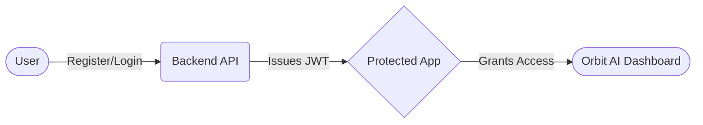
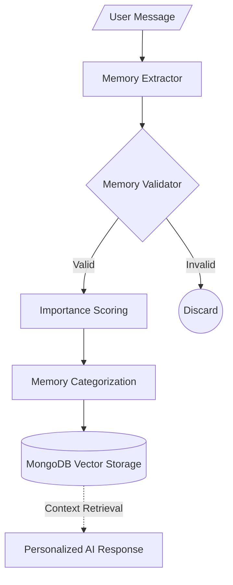
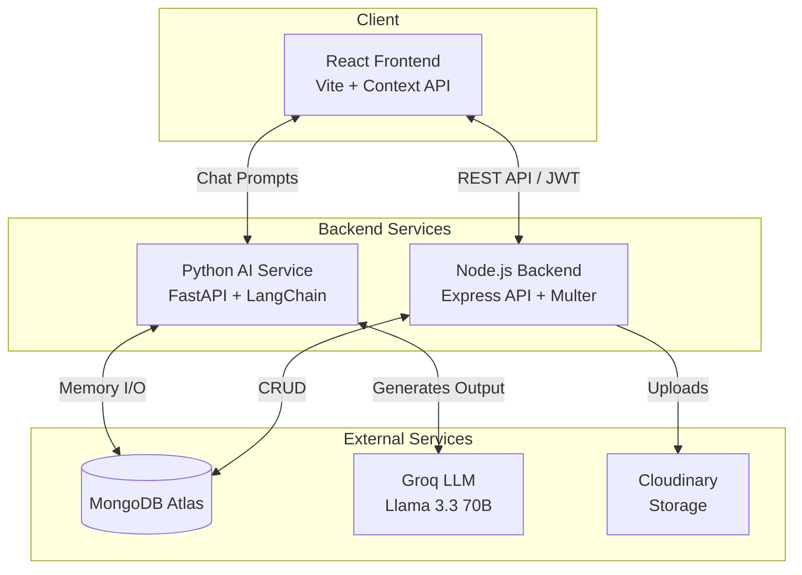
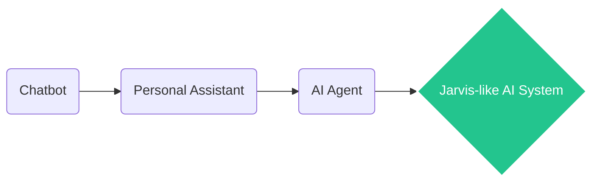

<div align="center">

# 🚀 Orbit AI Personal Assistant

### Your Intelligent AI Companion with Memory, Conversations & Personalization

*Built with Modern Full Stack Development + Generative AI Architecture*

<br/>


</div>

<br/>

## 🌌 About Orbit AI

**Orbit AI Personal Assistant** is an intelligent AI-powered companion designed to provide personalized conversations, maintain deep user context, and evolve into a complete personal AI agent. 

Unlike traditional stateless chatbots, Orbit AI focuses on:
- **Conversational Intelligence:** Natural, context-aware dialogues.
- **User Personalization:** Adapts to your preferences and style.
- **Long-term Memory:** Remembers important facts, goals, and technical stacks across sessions.
- **Scalable Architecture:** Built on a robust microservices-inspired foundation.

**The Vision:** To build a *Jarvis-like* personal AI assistant capable of deeply understanding users, autonomously managing information, and streamlining daily tasks.

---

## 📑 Table of Contents
- [Features](#-features)
- [System Architecture](#️-system-architecture)
- [Tech Stack](#-tech-stack)
- [Project Structure](#-project-structure)
- [Installation & Setup](#-installation--setup)
- [Environment Variables](#-environment-variables)
- [Roadmap & Vision](#-roadmap--vision)
- [Contributing](#-contributing)
- [License & Author](#-license--author)

---

## ✨ Features

### 🤖 AI Chat System
- Real-time AI conversations via Groq API (Llama 3.3 70B).
- Multiple persistent chat sessions.
- Rich message formatting with typing indicators and timestamps.
- Complete conversation management (Rename, Delete, Clear).

### 🔐 Authentication System
- Secure JWT-based registration and login.
- Support for both Email and Username identifiers.
- Persistent, protected sessions.



### 👤 User Profile System
Orbit AI provides a personalized user profile management system that allows users to customize and manage their identity within the platform.

**Features:**
- Update personal information (Name, Username).
- Dynamic avatar management with automatic cloud storage integration.
- Secure image handling through Cloudinary.
- Real-time UI synchronization via React Context architecture (no page reload required).

---

### 🧠 AI Memory System
Orbit AI includes an intelligent memory architecture designed to understand, store, and retrieve important user context for creating personalized AI conversations.

**Memory Categories:**

| Category | Description |
|----------|-------------|
| **Personal** | User identity and personal details |
| **Education** | Academic background and learning information |
| **Goals** | User objectives, ambitions, and future plans |
| **Skills** | Programming skills and technical abilities |
| **Technology**| Tools, frameworks, and technologies user works with |
| **Projects** | User projects and development activities |
| **Preferences**| User choices, interests, and interaction preferences |

**Memory Pipeline:**


---

## 🏗️ System Architecture



---

## 🛠️ Tech Stack

Orbit AI is built using modern full-stack and AI technologies to provide a scalable, intelligent, and personalized AI assistant experience.

| Domain | Technologies |
|--------|--------------|
| 🎨 **Frontend** | React, Vite, React Router, Context API, Bootstrap 5, Axios, CSS3 |
| ⚙️ **Backend** | Node.js, Express.js, JWT Authentication, Multer, Helmet, CORS |
| 🧠 **AI Service** | Python, FastAPI, Groq API (Llama 3.3 70B), LangChain |
| 🗄️ **Storage** | MongoDB Atlas, Mongoose, Cloudinary |

---

## 📂 Project Structure

```text
Orbit-AI/
├── frontend/                 # React UI Client
│   ├── src/
│   │   ├── components/       # Reusable UI parts
│   │   ├── context/          # Global state
│   │   ├── pages/            # Main views
│   │   └── services/         # API integration
│   └── package.json
│
├── backend/                  # Node.js REST API
│   ├── src/
│   │   ├── controllers/      # Route logic
│   │   ├── middlewares/      # JWT, Multer
│   │   ├── models/           # Mongoose schemas
│   │   └── routes/           # API endpoints
│   └── package.json
│
└── ai_service/               # Python FastAPI Microservice
    ├── chains/               # LLM logic
    ├── memory/               # Memory extraction engine
    ├── routes/               # FastAPI routes
    └── requirements.txt
```

---

## 🚀 Installation & Setup

Follow these steps to run Orbit AI locally.

### 📋 Prerequisites
Before starting, make sure you have installed:
- Node.js (v18+ recommended)
- npm
- Python (v3.10+ recommended)
- MongoDB Atlas account
- Cloudinary account
- Groq API Key

---

### 1. Clone Repository
```bash
git clone [https://github.com/riturajlabs/Orbit-AI.git](https://github.com/riturajlabs/Orbit-AI.git)
cd Orbit-AI
```

### 2. 🎨 Frontend Setup
Open a terminal and navigate to the frontend directory:
```bash
cd frontend
npm install
```
Create a `.env` file in the `frontend/` directory and add:
```env
VITE_API_URL=http://localhost:5000
VITE_AI_SERVICE_URL=http://localhost:8000
```
Start the frontend development server:
```bash
npm run dev
```
*Frontend runs on `http://localhost:5173`*

---

### 3. ⚙️ Backend Setup
Open a new terminal and navigate to the backend directory:
```bash
cd backend
npm install
```
Create a `.env` file in the `backend/` directory and add:
```env
PORT=5000
NODE_ENV=development
MONGODB_URI=your_mongodb_atlas_connection_string
JWT_SECRET=your_jwt_secret
JWT_EXPIRES_IN=7d
GROQ_API_KEY=your_groq_api_key
AI_SERVICE_URL=http://localhost:8000
CLOUDINARY_CLOUD_NAME=your_cloud_name
CLOUDINARY_API_KEY=your_cloud_api_key
CLOUDINARY_API_SECRET=your_cloud_api_secret
```
Start the backend server:
```bash
npm run dev
```
*Backend runs on `http://localhost:5000`*

---

### 4. 🧠 AI Service Setup
Open another terminal and navigate to the AI service directory:
```bash
cd ai_service
```
Create and activate a virtual environment, then install dependencies:
```bash
# Create virtual environment
python -m venv venv

# Activate (Linux/macOS)
source venv/bin/activate
# Activate (Windows)
venv\Scripts\activate

# Install dependencies
pip install -r requirements.txt
```
Create a `.env` file in the `ai_service/` directory and add:
```env
GROQ_API_KEY=your_groq_api_key
MONGODB_URI=your_mongodb_atlas_connection_string
```
Run the AI service:
```bash
python app.py
```
*AI Service runs on `http://localhost:8000`*

---

### ✅ Verify Local Setup
After starting all three services, verify they are running successfully:

| Service | Address / Status |
| :--- | :--- |
| **Frontend** | `http://localhost:5173` |
| **Backend API** | `http://localhost:5000` |
| **AI Service** | `http://localhost:8000` |
| **Database** | MongoDB Atlas Connected |
| **File Storage** | Cloudinary Connected |

🚀 **Orbit AI is now running locally!**

---

## 🛣️ Roadmap & Vision

### 🧪 Current Status: Orbit AI v1.0.0
Orbit AI v1.0 focuses on building a secure, personalized AI assistant foundation.
- [x] Secure JWT Authentication
- [x] Real-time AI Chat & Conversation History
- [x] User Profile Management & Cloud Avatar Storage
- [x] MongoDB Atlas Database Integration
- [x] Core AI Memory Architecture

### 🚀 Upcoming Versions

**🧠 Orbit AI v2.0 — Advanced Knowledge System**
- [ ] RAG Pipeline & Document Uploads
- [ ] Personal Vector Knowledge Base
- [ ] Enhanced Semantic Context Retrieval

**🤖 Orbit AI v3.0 — AI Agent System**
- [ ] Tool Calling & Web Search Integration
- [ ] Task Automation & Calendar Synchronization
- [ ] Email Assistant Capabilities

**🛸 Orbit AI v4.0 — The Jarvis Vision**
- [ ] Multi-modal AI (Voice & Vision)
- [ ] Real-time Conversational Voice Interface
- [ ] Local Computer Control & Smart Home Integration

**Evolution Path:**


---

## 🤝 Contributing

Contributions, issues, and feature requests are welcome!

1. Fork the Project
2. Create your Feature Branch (`git checkout -b feature/AmazingFeature`)
3. Commit your Changes (`git commit -m "Add some AmazingFeature"`)
4. Push to the Branch (`git push origin feature/AmazingFeature`)
5. Open a Pull Request

---

## 📜 License

Distributed under the MIT License. See `LICENSE` file for more information.

---

## 👨‍💻 Author

**Ritu Raj**  
*B.Sc Artificial Intelligence & Machine Learning Student | Full Stack Developer | AI Enthusiast*

- **GitHub:** [@riturajlabs](https://github.com/riturajlabs)
- **Linkedin:** [@riturajlabs](https://linkedin.com/in/riturajlabs)

<div align="center">
  <br/>
  ⭐ If you like this project, consider dropping a star on the repository! <br/>
  <i>Built with ❤️ by riturajlabs</i>
</div>
